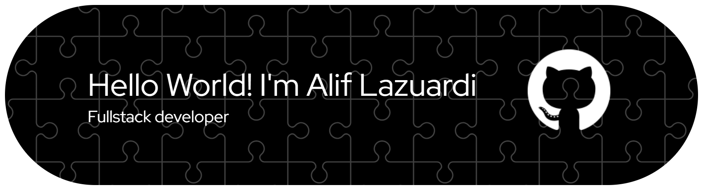

##  Hello World! I'm Alif Lazuardi 👋

##### Skills

##### About Me

Lorem ipsum 

<!--  

 -->

<!-- ##### Connect With Me

 -->
<h5 align="left">Connect with me:</h5>

<!-- ##### My Github Stats
 -->

##### Play With Me

